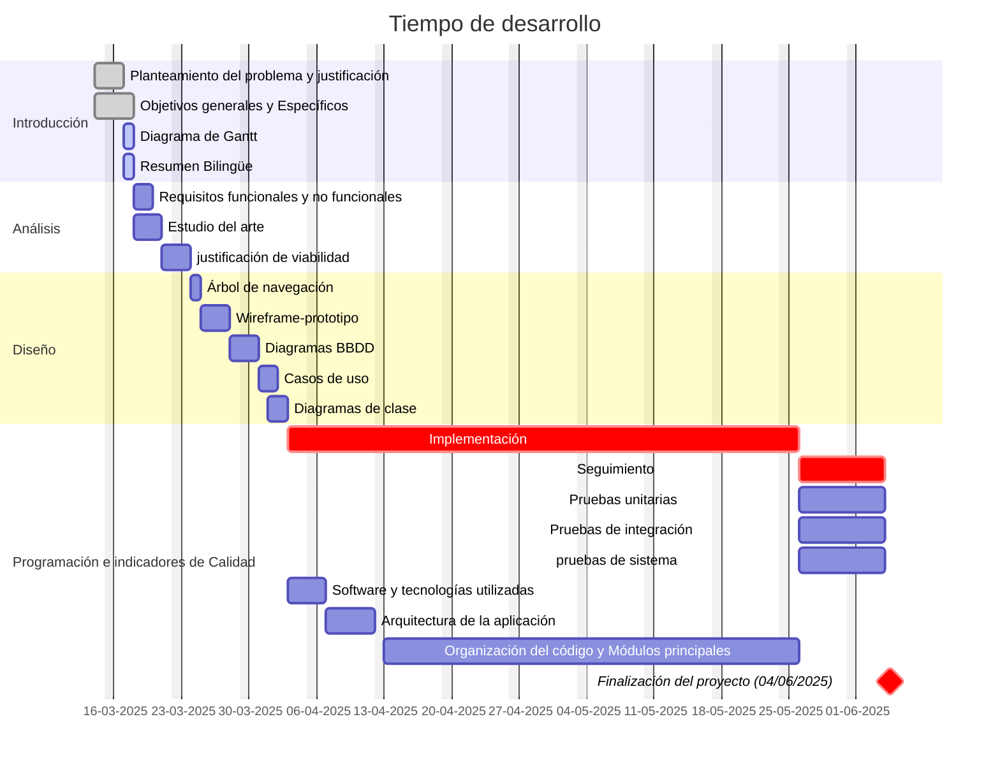

## 1. Planteamiento del problema y justificación
>[!info] Describir claramente el problema a resolver, la relevancia del proyecto y las razones que justifican su desarrollo.

Cuando se quiere mejorar en una disciplina deportiva, es esencial llevar un correcto seguimiento del rendimiento y el progreso. Los métodos tradicionales de boli y papel o de meter todo en las notas del móvil son lentos, no siguen una estructura y, dependiendo de la persona, pueden acabar haciendo más mal que bien.

Por otra parte las aplicaciones existentes deportivas son copias la una de la otra, suelen tener limitaciones, no son lo suficientemente flexibles y en todas el foco principal es hacer ejercicios, dejando de lado o quitando valor a los datos que proporciona el entrenamiento.

De esta forma, el usuario no tiene la información que necesita para saber si lo está haciendo bien, si ha mejorado con respecto al mes pasado, etc.

Por mi experiencia, se lo importante y valioso que es saber cómo estás entrenando, te motiva y puedes ver que tu rendimiento aumenta, por eso creando una metodología que haga sencillo e intuitivo el registro de los datos durante el entrenamiento que el usuario podrá ver una mejora significativa en su progreso.

## 2. Objetivos del proyecto
>[!info] Establecer los objetivos generales y específicos del proyecto, indicando qué se pretende lograr.

### Objetivos generales
- Desarrollar una aplicación de entrenamiento adaptada a una amplia gama de actividades deportivas con un enfoque en el seguimiento y registro de los datos en el entrenamientos.
### Objetivos específicos
- Incorporar un sistema que haga fácil, intuitivo y rápido el proceso de registro y presentación de los entrenamientos.
- Añadir una sección con utilidades para el entrenamiento.
- Añadir un portal educativo para los entrenamientos.
- Añadir una sección de configuración.
- Crear una sección para el perfil del usuario.

## 3. Diagrama de Gantt
A continuación, se presenta el diagrama de Gantt que especifica el tiempo de desarrollo para completar la aplicación web.

## 4. Resumen bilingüe
>[!info] Elaborar un resumen del proyecto en ambos idiomas con una extensión mínima de 20 líneas. Debe reflejar el propósito del proyecto, sus objetivos principales y una visión general de la metodología utilizada.
### Español
En la actualidad, seguir el progreso en los entrenamientos es fundamental para mejorar el rendimiento deportivo. Sin embargo, los métodos tradicionales que llevamos utilizando toda la vida tienen limitaciones y son poco eficientes; por otro lado, las aplicaciones disponibles en el mercado se centran en la ejecución de los ejercicios y dejan a un lado la recopilación y el análisis de datos en el entrenamiento.

Este proyecto tiene como objetivo desarrollar una aplicación web que cubra esa falta existente en las aplicaciones deportivas de un sistema útil de registro de datos junto a su presentación al usuario. La aplicación estará diseñada para poder adaptarse a múltiples disciplinas deportivas, permitiendo a cada usuario diseñar sus propias rutinas y establecer los datos que quieran ver.

La aplicación contará con un sistema de registro eficiente para los ejercicios, se podrá tener acceso directo a él desde la página principal y este mostrará un resumen de los datos, pudiendo tener una visión completa de estos accediendo al día que se quiera consultar, un portal educativo donde el usuario podrá consultar y aprender todo tipo de ejercicios, un menú de ajustes para realizar cambios en el comportamiento y el aspecto de la aplicación y un perfil de usuario donde se podrá ver, modificar y añadir la información respectiva al usuario.

Para el desarrollo de la aplicación, se empleará el framework de JavaScript React para realizar la interfaz de usuario y poder así proporcionar una experiencia moderna, rápida y responsiva, además de tecnologías como PHP para la comunicación con la base de datos MySQL y los servicios en la nube AWS (Amazon Web Services) para almacenar tanto la aplicación como los recursos de esta.

Se implementará una metodología ágil para facilitar el proceso de desarrollo y poder así permitir la integración de nuevas funcionalidades a medida que avance la aplicación.

### Inglés
Nowadays, tracking progress during training is essential to improve sports performance. However, traditional methods that we have been using all of our lives have limitations and are not very efficient; on the other hand, the existing applications available on the market focus solely on the execution of exercises and leave aside the collection and analysis of training data.

This project aims to develop a web application that fills this gap in the existing sports applications with a useful data recording system as well presenting it to the user. The application will be designed to be compatible with multiple sports activities, allowing each user to design their own routines and establish the data they want to see.

The application will have an efficient data recording system for the exercises, which can be accessed directly from the home page and will initially show a summary of the data as well as a complete view of it by clicking the desired day to view, an educational portal through which the user can view and learn all kinds of exercises, a settings menu to make changes in the behavior and appearance of the application and a user profile where users can view, modify and add their respective information.

For the development of the application, the JavaScript framework React will be used to create the user interface and thus provide a modern, fast and responsive experience, in addition to technologies such as PHP for communication with the MySQL database and the cloud service AWS (Amazon Web Services) to store both the application and its resources.

An agile methodology will be implemented to facilitate the development process and allow the integration of new features as the application progresses.